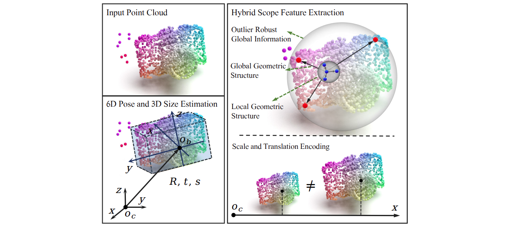

# TODOs
- [ ] Add paper link
- [ ] Add Bibtex

# HS-Pose (CVPR 2023)
Pytorch implementation of HS-Pose: Hybrid Scope Feature Extraction for Category-level Object Pose Estimation.
([Paper](), [Project](https://lynne-zheng-linfang.github.io/hspose.github.io/))



<p align="center">
    Illstraction of the hybrid feature extraction.
</p>


<p align="center">
    The overall framework.
</p>


## UPDATE!


## Required environment
- Ubuntu 18.04
- Python 3.8 
- Pytorch 1.10.1
- CUDA 11.2
- 1 * RTX 3090
 

## Virtual environment
```shell
cd HS-Pose
virtualenv HS-Pose-env -p /usr/bin/python3.8
```
Then, copy past the following lines to the end of `/HS-Pose-env/bin/activate` file:
```shell
CUDAVER=cuda-11.2
export PATH=/usr/local/$CUDAVER/bin:$PATH
export LD_LIBRARY_PATH=/usr/local/$CUDAVER/lib:$LD_LIBRARY_PATH
export LD_LIBRARY_PATH=/usr/local/$CUDAVER/lib64:$LD_LIBRARY_PATH
export CUDA_PATH=/usr/local/$CUDAVER
export CUDA_ROOT=/usr/local/$CUDAVER
export CUDA_HOME=/usr/local/$CUDAVER
```
Then, use `source` to activate the virtualenv:
```shell
source HS-Pose-env/bin/activate
```


## Installing
- Install [CUDA-11.2](https://developer.nvidia.com/cuda-11.2.0-download-archive?target_os=Linux&target_arch=x86_64&target_distro=Ubuntu&target_version=2004&target_type=deblocal) 

- Install basic packages:
```shell
chmod +x env_setup.sh
./env_setup.sh
```
<!-- - Install [Detectron2](https://github.com/facebookresearch/detectron2). -->

## Data Preparation
To generate your own dataset, use the data preprocess code provided in this [git](https://github.com/mentian/object-deformnet/blob/master/preprocess/pose_data.py).
Download the detection results in this [git](https://github.com/Gorilla-Lab-SCUT/DualPoseNet).
Change the `dataset_dir` and `detection_dir` to your own path.


## Trained model
Download the trained model from this [google link](https://drive.google.com/file/d/1TszIS5ebECVpLyEbukOhb7QhVIwPeTIM/view?usp=sharing) or [baidu link](https://pan.baidu.com/s/1Y8Gb0azh7lWt8XEgfNY_cw) (code: w8pw). After downloading it, please extracted it and then put the HS-Pose-weights folder into the `output/models/` folder. Run the following command to check the results:
```shell
python -m evaluation.evaluate  --model_save output/models/HS-Pose_weights/eval_result --resume 1 --resume_model ./output/models/HS-Pose_weights/model.pth --gcn_n_num 20 --eval_seed 1677483078
```

## Training
Please note, some details are changed from the original paper for more efficient training. 

Specify the dataset directory and run the following command.
```shell
python -m engine.train --dataset_dir YOUR_DATA_DIR --model_save SAVE_DIR
```

Detailed configurations are in `config/config.py`.

## Evaluation
```shell
python -m evaluation.evaluate --dataset_dir YOUR_DATA_DIR --detection_dir DETECTION_DIR --resume 1 --resume_model MODEL_PATH --model_save SAVE_DIR
```

## Example
You can run the following training and testing commands to get the results below.
```shell
python -m engine.train --model_save output/models/HS-Pose/ --num_workers 20 --batch_size 16 --train_steps 1500 --seed 1677330429
python -m evaluation.evaluate  --model_save output/models/HS-Pose/model_149 --resume 1 --resume_model ./output/models/HS-Pose/model_149.pth --eval_seed 1677483078
```
|Metrics| IoU75 | IoU50 | IoU25 | 5d2cm | 5d5cm | 10d2cm| 10d5cm| 10d10cm|  5d   | 2cm   |
|:------|:------|:------|:------|:------|:------|:------|:------|:-------|:------|:------|
|Scores | 84.3  | 82.8  | 75.3  |  46.2 |  56.1 | 68.9  | 84.1  | 85.2   | 59.1  | 77.8  |


## Citation
Cite us if you found this work useful.

## Acknowledgment
Our implementation leverages the code from [3dgcn](https://github.com/j1a0m0e4sNTU/3dgcn), [FS-Net](https://github.com/DC1991/FS_Net),
[DualPoseNet](https://github.com/Gorilla-Lab-SCUT/DualPoseNet), [SPD](https://github.com/mentian/object-deformnet), [GPV-Pose](https://github.com/lolrudy/GPV_Pose).